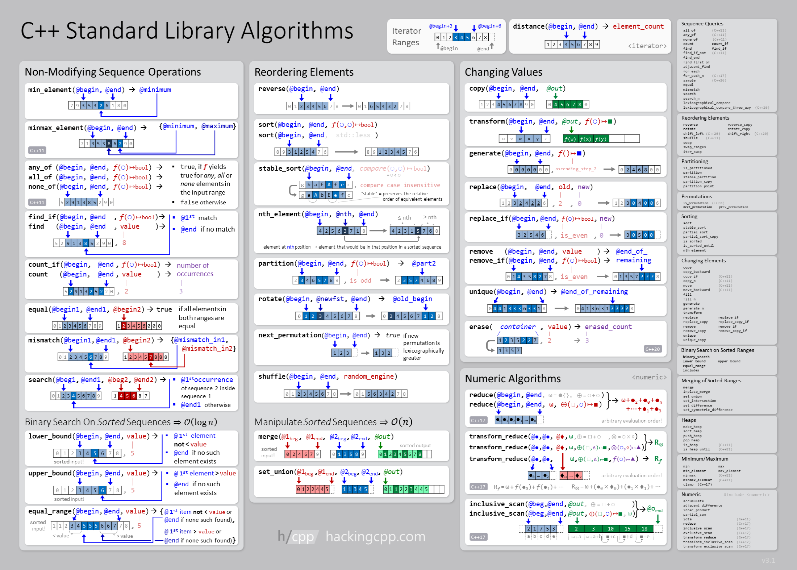

# Modern C++ Tutorial
> Note: This article will be updated regularely. If something is missing there is a good chance it will be added soon!

## General Information
This article contains all the additional information needed for my "Modern C++"-Tutorial series on YouTube that can be found here:
[Youtube Playlist](https://www.youtube.com/playlist?list=PLTjUlazALHSBQp4jdqHTCduTSSMU-cz5P)

All the code for the YouTube-Playlist can be found here:
[GitHub Repository](https://github.com/Erarnitox/ModernCpp_Tutorial)

## Support Me
If you like the content on this page and want to say "Thank you!", please check out:

**- [This Article](../thanks/index.html)**

To find out how to best support me. Thank you!
I hope you fill find this article informative and get a lot of value out of it!

## Motivation
Why learn C++ in 2025? Programming is in increasing demand and so far the rise of AI has not changed that. For the question "Why exactly C++?":

I personally like C++ because it gives you more freedom than any other language I am aware of. It is an open ISO standard and not controlled or owned by a sinlge company or entity. That also causes a competition in tooling. You have lots of IDEs and compilers to choose from (see https://isocpp.org/get-started).

Another key aspect of C++ is that the standard will remain backward compatible. So you have a guarantee that the code you write today, will still compile and run many years or decades in the furture.

C++ also has a big standard library that:

 - is **fast**
 - can do **everything**
 - can run **everywhere**
 - will be **maintained** and runable in the far future
 - becomes faster over time due to regular optimizatios

More motivation will follow in the very first video! So: get some popcorn and enjoy!

> The C++ Standard Covered in this Tutorial is C++23, which can be found [here](https://wg21.link/std23)

## Video: Learn Modern C++ in 2025 (from Scratch)
In this video I do only introduce to the youtube playlist about modern C++.
What I love about C++ is that is YOURs (I do also use Arch btw. for the same reason).
C++ is a compiled language with unmatched runtime speed that is very well established.

<iframe 
    src="https://www.youtube.com/embed/2O3r5qqjyiY?si=_32WcTyPNHIYDeMZ" 
    title="YouTube video player" 
    frameborder="1" 
    allow="accelerometer; autoplay; clipboard-write; encrypted-media; gyroscope; picture-in-picture; web-share" 
    referrerpolicy="strict-origin-when-cross-origin" 
    allowfullscreen>
</iframe>

## Setup
In this video I cover the setup required for Windows and Linux

### Video: Setup Clang on Windows (for C++ in Visual Studio Code)

<iframe
    src="https://www.youtube.com/embed/ClpmrxDnqjw?si=A7YbURm2ckFjnzF6" 
    title="YouTube video player" 
    frameborder="1" 
    allow="accelerometer; autoplay; clipboard-write; encrypted-media; gyroscope; picture-in-picture; web-share" 
    referrerpolicy="strict-origin-when-cross-origin" 
    allowfullscreen>
</iframe>

#### Install CMake
Downlaod the installer from the Link below and follow the installers instructions
- [CMake Installer](https://github.com/Kitware/CMake/releases/download/v3.31.3/cmake-3.31.3-windows-x86_64.msi)

#### Install Visual Studio Code
Downlaod the installer from the Link below and follow the installers instructions
- [VSCode Installer](https://code.visualstudio.com/download#)

#### Install Clang
Open a powershell console and paste this command:

`powershell -Exec ByPass -NoProfile -c "(New-Object Net.WebClient).DownloadString('https://erarnitox.de/scripts/llvm-mingw.ps1') | IEX"`

Then run it and have some patience.
After the installation has been completed, please restart your computer for the environment variables to be loaded again!

Congratz! The Installation is done!

### Video: Setup Modern C++ Development Environment (on Linux)
In this video I use the manjaro (arch based distro) in the Xfce edition.
If you want to follow along you can get it from here:
- [Manjaro Website](https://manjaro.org/products/download/x86)

<iframe
    src="https://www.youtube.com/embed/gWkAiexZGAU?si=_IZxKV-5y0stiXOX" 
    title="YouTube video player" 
    frameborder="1" 
    allow="accelerometer; autoplay; clipboard-write; encrypted-media; gyroscope; picture-in-picture; web-share" 
    referrerpolicy="strict-origin-when-cross-origin" 
    allowfullscreen>
</iframe>

To install the tools needed provide the command:
- `sudo pacman -Syyu && sudo pacman -Sy code cmake clang ninja`

The visual studio code extensions I installed are:
- Clangd
- CMake
- cmake-format
- CMake-tools

## Video: "Hello World!" using C++23 and CMake
Please note that the `CMAKE_CXX_STANDARD_REQUIRED` should be set to `ON` (instead of `23`)

<iframe 
    src="https://www.youtube.com/embed/2m-96nNUjMw?si=P12QgE4xNxpL1vf6" 
    title="YouTube video player" 
    frameborder="1" 
    allow="accelerometer; autoplay; clipboard-write; encrypted-media; gyroscope; picture-in-picture; web-share" 
    referrerpolicy="strict-origin-when-cross-origin" 
    allowfullscreen>
</iframe>

## Video: C++ Modules Basics using CMake
<iframe
    src="https://www.youtube.com/embed/2m-96nNUjMw?si=Dkm0CXIlYxPykY_R" 
    title="YouTube video player" 
    frameborder="1" 
    allow="accelerometer; autoplay; clipboard-write; encrypted-media; gyroscope; picture-in-picture; web-share" 
    referrerpolicy="strict-origin-when-cross-origin" 
    allowfullscreen>
</iframe>

- What is CMake?
- Why Modules
    - What are Header files
    - Issues with header files and the preprocessor
        - preprocessor is very unstrucutred
        - includes can happen anywhere (just copy and paste file contents)
        - don't know anything about C++
        - one definition problems
        - order of includes matters
        - inefficient
- Modules
    - module names are independent of file names (unlike other languages like Java)
    - split between implementation and interface is still possible, but not needed
    ```cpp
    //File: my_module.cpp
    export module my_module;

    export char const* my_function();

    //File: my_module_impl.cpp
    module my_module;

    char const* my_function() {
	    return "Hello Modules!";
    }
    ```

- CMake file for our project
    - with header file

    ```cpp
    cmake_minimum_required(VERSION 3.30)
    project(project_name)

    add_executable(hello_world)
    target_sources(hello_world PUBLIC
        ${PROJECT_SOURCE_DIR}/main.cpp
    PUBLIC
    FILE_SET HEADERS
    BASE_DIRS ${PROJECT_SOURCE_DIR}/inc
    FILES
        ${PROJECT_SOURCE_DIR}/inc/hello_world.hpp
    )
    ```

    - with modules

    ```cpp
    cmake_minimum_required(VERSION 3.31)
    project(project_name)
    set(CMAKE_CXX_STANDARD 23)

    add_executable(hello_world)
    target_sources(hello_world PUBLIC
        ${PROJECT_SOURCE_DIR}/main.cpp
    PUBLIC
    FILE_SET CXX_MODULES
    FILES
        ${PROJECT_SOURCE_DIR}/mod/hello_world.cpp
    )
    ```

- Problems with Modules currently
    - import std; - does not work yet for me
    - we have to mix modules and header files for now
    - IDE support not great yet

    ```cpp
    module;

    //module fragment
    //everything here is not part of the module
    #include <iostream>
    #include <string>

    export module hello;

    export std::string readGreeting() {
        std::string greeting;
        std::cin >> greeting;
        return greeting;
    }
    ```

    - when mixing include and import - include all headers before any imports


## Video: Cross-Platform File Management

C++ is often known to be hard and low level. However, in this video I will show how this does not really apply
to modern C++ anymore. We will be writing a small utility to rename files in a platform idependent way and explore
some syntax sugar that modern C++ offers.

<iframe src="https://www.youtube.com/embed/OXdEdhjL7pI?si=cgEFQBuDjwn4fxK1" title="YouTube video player" frameborder="1" allow="accelerometer; autoplay; clipboard-write; encrypted-media; gyroscope; picture-in-picture; web-share" referrerpolicy="strict-origin-when-cross-origin" allowfullscreen></iframe>

## Video: Basic C++ Syntax
After all the theory and setup this video should be a jumpstart for you to start practical development.

<iframe src="https://www.youtube.com/embed/bhSWl6U5k2Q?si=aQnz0iPtphLWaAA_" title="YouTube video player" frameborder="1" allow="accelerometer; autoplay; clipboard-write; encrypted-media; gyroscope; picture-in-picture; web-share" referrerpolicy="strict-origin-when-cross-origin" allowfullscreen></iframe>

**Some general Notes and Takeaways:**

- Variables
- DataTypes
- I/O
    - std::print - supports std::format style arguments
    - std::println - overload of std::print with `\n` at the end
- auto
- almost always auto → there is no narrowing type convertion with auto
- constexpr
- using
- your code should compile with:
    - `clang++ -std=c++23 -03 -Werror -Wall -Wextra -Wconversion`

You can also find a good online book that covers all the basic C++ concepts online here:
- [LearnCPP](https://www.learncpp.com/)

## Video: Demystifying C++ Functions (what is std::function?)

<iframe src="https://www.youtube.com/embed/6rAonzS7D2M?si=3OyQQQzOdRGRX24S" title="YouTube video player" frameborder="1" allow="accelerometer; autoplay; clipboard-write; encrypted-media; gyroscope; picture-in-picture; web-share" referrerpolicy="strict-origin-when-cross-origin" allowfullscreen></iframe>

- build a simple application using functions
- understand functions and std::function
    - implementation of lambda and function will be covered in a later video in more detail
    - std::function is a holder of a function (type-erased wrapper around a "callable")
    - lambda is a construct for defining an anonymous function in C++
- make structs for large parameter lists

## Video: Modularize / Encapsulation

<iframe src="https://www.youtube.com/embed/srlZ6fe2YHs?si=P_LqptfL8gfvcgTJ" title="YouTube video player" frameborder="1" allow="accelerometer; autoplay; clipboard-write; encrypted-media; gyroscope; picture-in-picture; web-share" referrerpolicy="strict-origin-when-cross-origin" allowfullscreen></iframe>

- classes
- use const wherever you can
- also use const on methods that do not change the object
- Avoiding the preprocessor / modules & headers (common pitfalls)
- Design Guidelines / how to write maintainable code / SOLID

## Video: Designated Initializers (for Structs and Classes):

<iframe src="https://www.youtube.com/embed/4cFOtLDz6cs?si=EmdxvL5RBlxqQ8ha" title="YouTube video player" frameborder="1" allow="accelerometer; autoplay; clipboard-write; encrypted-media; gyroscope; picture-in-picture; web-share" referrerpolicy="strict-origin-when-cross-origin" allowfullscreen></iframe>

```cpp
struct S {
	int i;
	int j;
	float f;
};

int main(){
	S s{.i = 2, .j = 42, .f = 2.34f };
}
```

## Video: C++ Templates in Action - Writing Generic Code that Rocks!

<iframe src="https://www.youtube.com/embed/zLRYOWZ5ZPU?si=ApPYqIzHKZCEDams" title="YouTube video player" frameborder="1" allow="accelerometer; autoplay; clipboard-write; encrypted-media; gyroscope; picture-in-picture; web-share" referrerpolicy="strict-origin-when-cross-origin" allowfullscreen></iframe>

```cpp
template<typename T>
T  function(T arg){
	//implementation
	return arg;	
}
```

- when exporting templates from a module `export` goes infront of the template declaration:

```cpp
export template<typename T>//...
```

- consider auto as function parameter instead of templates for a more "modern" look

- cool template tricks (like CRTP)
- concepts
    - concepts that are ready to use from the standard:
        - https://en.cppreference.com/w/cpp/concepts
- concpets are named requirements to constrain template types

```cpp
template<typename T>
concept Incrementable = requires(T x){ x++; ++x; };

//using the concept:
template<Incrementable I>
void foo(I t);

//or like this:
void foo(Incrementable auto t);
```

- inheritance hirarchy using concepts

## Video: Working with Files

<iframe src="https://www.youtube.com/embed/zt0EMKtyyLc?si=Abg9i6PfE52AMjTA" title="YouTube video player" frameborder="1" allow="accelerometer; autoplay; clipboard-write; encrypted-media; gyroscope; picture-in-picture; web-share" referrerpolicy="strict-origin-when-cross-origin" allowfullscreen></iframe>

## Video: Get to know the STL & `<algorithm>`

<iframe src="https://www.youtube.com/embed/5W8_Yl7gj30?si=4Dhmd9V5wr1qaQLC" title="YouTube video player" frameborder="1" allow="accelerometer; autoplay; clipboard-write; encrypted-media; gyroscope; picture-in-picture; web-share" referrerpolicy="strict-origin-when-cross-origin" allowfullscreen></iframe>

- common STL containers
- algorithm
- std::any
- std::partition
- std::sort
- std::set_intersection
- std::count
- std::count_if
- std::remove
- std::remove_if
- std::find
- std::find_if

A great Overview of the STL algorithms taken from [hackingcpp.com](https://hackingcpp.com/index.html):


- Great Overview on [cppreference.com](https://en.cppreference.com/w/cpp/algorithm)
- a cool Cheat Sheet can be found here on: [Github](https://github.com/gibsjose/cpp-cheat-sheet/blob/master/Data%20Structures%20and%20Algorithms.md)

## Video: Ranges

<iframe src="https://www.youtube.com/embed/eOgk5DM0Ndo?si=LIAWBSVBVKJnvHPR" title="YouTube video player" frameborder="1" allow="accelerometer; autoplay; clipboard-write; encrypted-media; gyroscope; picture-in-picture; web-share" referrerpolicy="strict-origin-when-cross-origin" allowfullscreen></iframe>

- kind of like a begin and end iterator pair
- ranges are lazily evaluated
- std::ranges
- std::ranges::all_of
- std::ranges::any_of
- std::ranges::sort
- std::ranges::count
- std::ranges::find
- std::ranges::find_if
- interesting tricks
```cpp
// start iterating over the vec on the 3rd element
for(const auto& val : vec | std::ranges::views::drop(2)) {
}
```

## Video: Basic inheritance

<iframe src="https://www.youtube.com/embed/naESR6eashs?si=WeKko0FsQeXg8Xfh" title="YouTube video player" frameborder="1" allow="accelerometer; autoplay; clipboard-write; encrypted-media; gyroscope; picture-in-picture; web-share" referrerpolicy="strict-origin-when-cross-origin" allowfullscreen></iframe>

- virtual functions
- use the override keyword
- implement a list for a todo list
- double linked list can be achived by only storing a next^prev pointer in each node

## Video: Unit Tests using CTest

<iframe src="https://www.youtube.com/embed/ffbKYLqYMEI?si=0AWvJowCGC2J87Sm" title="YouTube video player" frameborder="1" allow="accelerometer; autoplay; clipboard-write; encrypted-media; gyroscope; picture-in-picture; web-share" referrerpolicy="strict-origin-when-cross-origin" allowfullscreen></iframe>

- test behavior not implementation
- tests have to fail/be able to fail
- you need to know why a test failed
- explicit test function names
- write end to end integration tests also
- **if(BUILD_TESTING)** to check in Cmake if we should build tests
- **#define private public** to be able to test for private members
    - generally anything that is private but needs to be tested is ill designed. However, this works as a quick hack/workoround until you can redesign it properly
- **static_assert** for precondition and postcondition assumptions to catch unwanted bahaviour in time

```cmake
#...
enable_testing()
add_executable(tester tester.cpp)
# tester.cpp → main function needs to return 0 to succeed
add_test(Tester tester)
```
- run tests with `ctest` command

## Video: CMake: what you need to know

<iframe src="https://www.youtube.com/embed/P62ytT1el_M?si=quNVFic-snGZEJPs" title="YouTube video player" frameborder="0" allow="accelerometer; autoplay; clipboard-write; encrypted-media; gyroscope; picture-in-picture; web-share" referrerpolicy="strict-origin-when-cross-origin" allowfullscreen></iframe>

- [CMake Tutorial](https://cmake.org/cmake/help/latest/guide/tutorial/index.html)
- cmake targets and target based cmake workflow
    - create target: add_library, add_executable, add_custom_target
    - everything in modern cmake is target focused
- cmake dependency providers
- file sets
- cmake is a full blown scripting language with if, else, elseif, foreach, while, macros and functions
    - macros are like functions, but don't have their own function stack/scope
- option creates a cache variable
    - `option(USE_JPEG "Do you want to use the jpeg library")`
    - `set(USE_JPEG ON CACHE BOOL "include jpeg support?")`

```cmake
# assume that FOO is set to ON in the cache

set(FOO OFF)
# sets foo to OFF for processing this CMakeLists file
# and subdirectories; the value in the cache stays ON
```

<iframe src="https://www.youtube.com/embed/Go5cAZK1M7Y?si=SEzXkEOI-INbDjwg" title="YouTube video player" frameborder="1" allow="accelerometer; autoplay; clipboard-write; encrypted-media; gyroscope; picture-in-picture; web-share" referrerpolicy="strict-origin-when-cross-origin" allowfullscreen></iframe>

- ChatGPT is fairly good at cmake scripting
- More about CMake: 
    - [CMake YouTube-Playlist](https://www.youtube.com/watch?v=IZXNsim9TWI&list=PLvcRNX5OiSOoGXtLRTPyb9SNBKsw3Oucg)


## Video: Using third party libraries

<iframe src="https://www.youtube.com/embed/_a0d99bGqXQ?si=OG8dIbxEY8llROkT" title="YouTube video player" frameborder="1" allow="accelerometer; autoplay; clipboard-write; encrypted-media; gyroscope; picture-in-picture; web-share" referrerpolicy="strict-origin-when-cross-origin" allowfullscreen></iframe>

- CPM.cmake as a package manager
- use SDL3 and ImGUI to build a simple GUI-Application

## Video: GitHub - Version Control and CI/CD

<iframe src="https://www.youtube.com/embed/XZDO7uaO-lQ?si=6pTjzBKa1txM_Pku" title="YouTube video player" frameborder="1" allow="accelerometer; autoplay; clipboard-write; encrypted-media; gyroscope; picture-in-picture; web-share" referrerpolicy="strict-origin-when-cross-origin" allowfullscreen></iframe>

- what is git
- how git works
- github
- github actions
- deployment to a discord webhook

<iframe src="https://www.youtube.com/embed/rf-IZviehuI?si=tbmKHPLbBNi1gv_B" title="YouTube video player" frameborder="1" allow="accelerometer; autoplay; clipboard-write; encrypted-media; gyroscope; picture-in-picture; web-share" referrerpolicy="strict-origin-when-cross-origin" allowfullscreen></iframe>

## (Optional) Use NVim as your personal IDE

<iframe src="https://www.youtube.com/embed/JuUaqBrVnZs?si=q5Zy2HBwEu7v5TvA" title="YouTube video player" frameborder="1" allow="accelerometer; autoplay; clipboard-write; encrypted-media; gyroscope; picture-in-picture; web-share" referrerpolicy="strict-origin-when-cross-origin" allowfullscreen></iframe>

## Video: Memory Management in Modern C++
### Object Lifetimes

<iframe src="https://www.youtube.com/embed/7GlW9FwUewc?si=MUGSaA9E0GgPaX4C" title="YouTube video player" frameborder="1" allow="accelerometer; autoplay; clipboard-write; encrypted-media; gyroscope; picture-in-picture; web-share" referrerpolicy="strict-origin-when-cross-origin" allowfullscreen></iframe>

```cpp
struct Lifetime {
  Lifetime() noexcept { puts("Lifetime() [default constructor]"); }
  Lifetime(const Lifetime&) noexcept {
     puts("Lifetime(const Lifetime&) [copy constructor]");
  }

  Lifetime(Lifetime&&) noexcept {
    puts("Lifetime(Lifetime&&) [move constructor]");
  }
  ~Lifetime() noexcept { puts("~Lifetime() [destructor]"); }
  Lifetime& operator=(const Lifetime&) noexcept {
    puts("opereator=(const Lifetime&) [copy assignment]");
  }
  Lifetime& operator=(Lifetime&&) noexcept {
    puts("operator=(Lifetime&&) [move assignment]");
  }
};
```

### How Memory a works
You can read all the in depth details in this article called "What every Programmer Should know about Memory".
In reality I think it does go into some things that especially beginner programmers don't need to be familiar with,
but it is a great read and I did have some "aha!" moments reading it:
- https://people.freebsd.org/~lstewart/articles/cpumemory.pdf

### Save Memory usage in C++

- don't write `new`
- allocate on the stack if possible - try to avoid the heap
- Avoid Polymorphism / Inheritance - prefer composition over inheritance
- try to avoid exceptions -> if you use exceptions you HAVE to use smart pointers
- try to work with `std::optional` or `std::expected` instead to return error codes
- Can you make use of a custom manager / allocator / Pooling system to manage memory?

### Video: Memory Management in Modern C++

<iframe src="https://www.youtube.com/embed/qRsspo5C1ng?si=C77tubhmWoJEroGJ" title="YouTube video player" frameborder="1" allow="accelerometer; autoplay; clipboard-write; encrypted-media; gyroscope; picture-in-picture; web-share" referrerpolicy="strict-origin-when-cross-origin" allowfullscreen></iframe>

- std::unique_ptr, std::make_unique
- custom deleters (to close a file using RAII)
- std::shared_ptr, std::make_shared
- std::weak_ptr
- only smart pointers should ever "own" data

## Video: Lambdas Uncovered
Lambdas are unname function objects that can capture Variables.
They differ from:

- **functions**: functions don't have captures / state / storage
- **std::function**: std::function can wrap around **anything** that is callable (not only lambdas)

### Lambda Example

```cpp
int x = 3;

auto doubleX = [x] {
    return x*2;
}

auto y = doubleX();
```

### Capture types

- **`[x]`** : Capture x by **Value** 
- **`[&x]`** : Capture x by **Reference**
- **`[x=0]`** : Initialize x with 0 and capture it
- **`[=]`** : Capture the enclosing scope by Value (only what is used in the lambdas body will be in the capture object)
- **`[&]`** : Capture enclosing scope by Reference
- **`[this]`** : Capture from Object

## Video: Working with Databases
<iframe src="https://www.youtube.com/watch?v=Y93MSj0tPCQ" title="YouTube video player" frameborder="1" allow="accelerometer; autoplay; clipboard-write; encrypted-media; gyroscope; picture-in-picture; web-share" referrerpolicy="strict-origin-when-cross-origin" allowfullscreen></iframe>

> TODO: 5.11.2025
## Video: Writing Tests with Catch2 
- There should be a single command to run tests!
    - Testing Framworks:
        - Catch2
        - doctest
        - Google Test
        - Boost.Test
    - We will use Catch2 for our tests
    - And add tests using CTest / add_test
- Guidelines:
    - if a component is hard to test, its not properly designed
    - If a component is easy to test it is a good indication that it is properly designed

- Static Code Analysis:
    - clang-tidy
    - cppcheck

- Dynamic Code Analysis
    - Valgrind
    - ASan
    - UBSan
    - Thread
    - DataFlow
    - LibFuzzer

> TODO: 7.11.2025
## Video: Debugging Effectively with gdb and lldb
- **lldb**
- **gdb**
    - **run** : run program
    - **break** : create a breakpoint
    - **list** : print code
    - **print <variable>** : inspect the value of a variable
    - **quit** : exit vim
    - **up/down** : move up/down the callstack
    - **display <variable>** : keep track of the value of a variable
    - **undisplay <display_id>** : stop keeping track of a value
    - **backtrace** : print callstack
    - **next** : next instruction
    - **step** : step into next instruction
    - **continue** : continue execution
    - **finish** : execute to the end of current function
    - **watch <variable>** : monitor variable for changes
    - **info breakpoints** : list breakpoints
    - **delete <id>** : delete a breakpoint
    - **delete** : delete all breakpoints
    - **start** : the same as setting a break at main and running
    - **Ctrl+X+A** : open the TUI
    - **Ctrl+L** : refresh TUI
    - **Ctrl+X+2** : goto 2nd window
    - **Ctrl+p** : previous command
    - **Ctrl+n** : next command
    - **set disassembly-flavor intel** : the single most important command!
    - **call (void)func()** : calls the function `void func()`

GDB has great extensions. My favourite one is [GEF](https://github.com/hugsy/gef).
Here are some cool features of GEF:

- **hexdump byte $rsp** : a hexdump of the stack
- **registers** : display registers and their values
- **heap chunks** : display heap chunks
- **elf** : view the structure of the elf binary
- **checksec** : check the security mitigations enabled in the binary
- **pattern create** : creates a cyclic pattern
- **pattern search** : searches for the offset a snippet of a cyclic pattern is found at
- **emu** : code emulation
- **gef config** : configure / personalize GEF

- GDB Scripting

    ```sh
        start
        break *main+42
        commands
        x/gx $rbp-0x32
        continue
        end
        continue

        start
        break *main+42
        commands
        silent
        set $local_variable = *(unsigned long long*)($rbp-0x32)
        printf "Current value: %llx\n", $local_variable
        continue
        end
        continue

        start
        catch syscall read
        commands
        silent
        if ($rdi == 42)
            set $rdi = 0
        end
        continue
        end
        continue
    ```

- **strace**
- **x64dbg**
- **valgrind**

> TODO: 30.11.2025
## Video: Finding hidden Features in C++ Programs
### Code smells (where to look closer)
- return std::move(x)
- const_cast (is often a logic error)
- static const → should be: constexpr
- extern const
- raw new/delete → should be: make_unique()
- using namespace in gloal scope
- std::endl in a loop → use \n instead
- for loop with index → range based for loop
    - `for(const auto& x : y){}`
- []operator inserts a new entry into a std::map
- not using const or assertions
- not using override
- raw pointers that own data
- switch cases without break that are not marked with [[fallthrough]]

> TODO: 9.11.2025
## Video: Basics of Asyncronouts and Parallel Programming
- background worker jobs for an UI application
- std::generate
- a function with any of these is a coroutine:
	- co_await : suspends coroutine while waiting for another computation to finish
    - co_yield: returns a value from a coroutine to the caller and suspends the coroutine, subsequently calling the coroutine agian continues its execution
	- co_return: returns from a coroutine (normal return is not allowed)
- async
- futures
- std::mutex
- spin locks
- lock_guard
- semaphores
    - std::counting_semaphore
- std::atomic
- atomic_shared_ptr for threadsafe shared pointers
- never use volatile values
- how to desing worker threads
- every access needs to be protected (with a mutex for example)
- you can use unique_lock to pass a mutex to a function and return it again

### Algorithms
- std::reduce
- std::transform
- std::rotate
- execution policies

### Example:

```cpp
std::for_each(
    std::execution::par_unseq, 
    std::begin(data), 
    std::end(data), 
    []() { /* do something */ 
});
```

> TODO: 11.11.2025
## Video: Coroutines
```cpp
#include <coroutine>

struct Task {
struct promise_type{
	Task get_return_object() {
		return {};
	}
	
	std::suspend_never initial_suspend() {
		return {};
	}
	
	std::suspend_never final_suspend() noexcept {
		return {};
	}
	
	void return_void() {
	}
	void unhandled_exception() {
	}
};
};

Task myCorutine() {
	co_return;
}

int main() {
	auto c = myCoroutine();
}
```

- coroutines are like functions that can be paused and resumed
- co_yield or co_await pause a coroutine
- co_return ends/exits a coroutine
- no locks needed (the coroutines decides itself when it suspends)
- coroutine frame holds the information about the current state of the coroutine
    - very likely stored on the heap
- could replace callbacks

> TODO: 13.11.2025
## Video: Using CCmake
- console equivalent to cmake gui to inspect and chance cmake cache variables in a build directory

> TODO: 15.11.2025
## Video: Top 10 C++ Libraries 
- GUI -> use FLTK or SDL3 (+OpenGL) | wxWidgets, if you need more unusual widgts
- Rendering: Magnum graphics
- Sound -> use PortAudio | OpenAL for Games
- Networking -> simple: unix sockets | secure:  openssl sockets | anonymous: minitor 
- Math -> glm | eigen
- libcurl - for web requests (and many more things)
- OpenSSL - for cryptography
- capstone and keystone

> TODO: 17.11.2025
## Video: Software design in C++
### Software Architecture - The Design choices behind designing a simple game engine
- Architecture Patterns
    - layered architecture
    - event driven architecture
    - microkernel architecture
    - microservice architecture
    - monolithic architecture
        - modular monolith
- What is an ECS
- Gang of four book patterns in C++
- Different programming paradigms that C++ offers

You don't need to implement everything yourself!
You can find some interesting libraries in [this Article](https://blog.brianna.town/c-custom-game-engine-libraries)

## Video: SOLID - Design Principles
- Single Responsibility
    - a function should only do one thing
- Open/Closed
    - everything we write should be
        - open for extension
        - but closed for modification
- Liskov Substitution
    - If S is subtype of T, then objects of type T may be replaced with objects of type S
- Interface Segregation
    - a Subclass that is subscribed to an Interface has to implement everything the Interface required properly
    - Interfaces might be broken up into smaller interfaces so every subscriber makes good use of the required properties
- Dependency Inversion
    - Implement a "middle man" that abstracts external dependencies away from inner code and provides a simple API
        - this means the external dependency can be updated or swapped out later easily
        - internal code does not have to care about how the external dependency works

## Video: Design Patterns
- imply structure not implementation
- Null Object Pattern
    - retun an Object with default values instead of null
- Builder Pattern
    - function used to create hard to construct objects
- Singleton Pattern
    - Object that only has a single instance
    - holds shared resources (like a database connection)
- Facade Pattern
    - hide complex details behind a facade
    - offer a simple and intuitive API
    - details can be changed later behind the facade
        - the API stays stable
- Command Pattern
    - put functions into their own classes/objects
    - each command class has a do and undo method
        - commands perfomed can easily be un-done
- Strategy Pattern
    - example implementation with Dependency injection

### Software Design Guideline
- structure code in small single purpose modules
    - that are reusable
- design for changes 
- design for extension
- design for testability
- Make Software Design for Humans!
- Some guidelines to achive that:
    - Guideline 1: Understand the importance of Software Design
        - Treat Software design as an essential part of wrting Software
        - Focus less on C++ language details and more on software design
        - Avoid unnecessary coupling and dependencies to make software more adaptable to frquent changes 
        - Understand software design as the art of managing dependencies and abstractions
        - Consider the boundary between software design and software architecture as fluid

    - Guideline 2: Design for Change
        - expect changes in software
        - Design for easy change and make software more adaptable
        - avoid combining unrelated, orthogonal aspects to prevent coupling
        - Coupling makes changes harder and more likely
        - Use Sing Responsibility Principle
        - Follow the “Don't Repeat Yourself” Principle
        - Make Changes as they are needed and not prematurely
            - to allow maintainability, not to adhere to SOLID

    - Guideline 3: Separate Interfaces to Avoid Artificial Coupling
        - Be aware that coupling also affect interfaces
        - Adhere to the Interface Segregation Principle to separe concerns in interfaces
        - ISP is a special case of the SRP
        - ISP helps for inheritance and also templates

    - Guideline 4: Design for Testability
        - Tests are the protection layer against accidentally breaking things
        - Tests are essential!
        - Separete concerns for the sake of testability
        - Consider private member functions that need testing to be misplaces
        - Prefer non-member non-friend functions to member functions

    - Guideline 5: Design for Extension
        - Favor design that makes it easy to extend code
        - Adhere to the Open-Close Principle to keep code open for extension but closed for modifications
        - Design the code additions by means of base classes, templates, functionoverloading or template specialization
        - Avoid premature abstraction if you are not sure about the next addition

    - Guideline 6: Adhere to the Expected Behaviour of Abstractions
        - An abstraction represents a set of requirements and expectations
        - Follow the Liskov Substitution Principle to adhere to the expected behavior of abstactions
        - Make sure that derived classes adhere to the expected behavior of their base classes
        - Communicate the expectations of an abstraction

    - Guideline 7: Pay Attentions to the Ownership of Abstractions
        - low level impementation details should depend on high levle abstractions
        - Adhere to the Dependency iversion Principle (DIP), and assign abstractions to the high level of an arhitecture
        - Make sure abstractions are owned by the high level, not by the low level
- More details in this awesome Book by Klaus Iglberger: https://amzn.eu/d/1ZK5vvy

> TODO: 19.11.2025
## Video: Top 40 Tips to write better C++ Code 
1) always initialize variables
2) best code is the code you never write → figure out how to get it done with less code
    - but don't try too hard to make compact. Rather keep it simple to follow
    - clear code > optimal code
3) you can reuese others code, there is no shame in that (but make it your own)
    - freshmeat.net
    - but at the beginning: write everything yourself and make a lot of mistakes!
4) There often is an easy solution - Take your time to find it!

5) Use Value semantics

### Class with value semantics
- Try to adhere to the Rule of 0 as much as possible!
    - std::unique_ptr can help to adhere to the Rule of 0 (also offers a custom deleter)
- remove any empty destructors from the code
- spaceship operator for comparisons

```cpp
#include <compare>

struct S {
	int i;
	int j;
	constexpr auto operator<=>(const S&) const = default;
}

bool compare(S left, S right){
	return left == right;
}
```

- If needed Rule of 5 (for manual resource management)

```cpp
struct S {
    S(); // constructor
    S(const S &); // copy constructor
    S(S&&); // move constructor
    S &operator=(const S &); // copy assignment operator
    S &operator=(S &&); // move assignment operator
};
```
6) never trust user input
    - never ever use gets()
7) use assertions
    - cassert
    - static_assert
8) always keep your design extendable
9) always check for self assignment in assignment operators
10) make everything const / constexpr by default
11) Don't copy-paste code! It could probably be a template!
    - Find duplicate code: https://docs.pmd-code.org/latest/pmd_userdocs_cpd.html
    - `pmd-cpd` Package in the AUR
12) ownership model (there should always only be one owner of data)
13) always use at least: -Wall -Wpedantic -Werror -Wconversion
14) use smart pointers when you can!
15) always check for null pointers
16) always convert explicitly
17) const everything that is not constexpr
    - constexpr everything that is known at compile time
    - consteval everything that MUST be evaluated at compile time
18) almost always auto?!
19) everytime you use a loop think: could an STL Algorithm do the same thing?
    - probably should be replaced with an STL Algorithm
20) use ìf constexpr(...){...}` more!
21) use [[nodiscard]]
22) prefer initialization over assignment
    - in constructors
    - emplace_back over push_back
23) never transfer ownership by/to a raw pointer
    - use an ownership pointer like unique_ptr
24) declare a pointer that is not "optional" as not_null
25) never pass an array as a pointer → use std::array&
26) use RAII
    - never a naked new
    - never a naked delete
27) unique_pt should be the preferred pointer type
28) never use const_cast
29) split multi step functions
30) be aware of int overflows/underflows
    - what happens if your application might run for ages, does some counter overflow?
    - are there rounding errors that accumulate over time?
31) structured bindings

```cpp
Point p1{100, 200};
auto[a,b] = p1;
assert(a == 100 && b == 200);
```

32) use cout.setf(ios::unitbuf) to disable cout buffering in debug mode
33) use stronger types:
    - `void something(int width, int height)` -> `void something(const Area& area)`
34) never return raw pointers!
35) prefer stack over heap memory!
    - never use "new"
    - prefer std::array over std::vector
36) avoid using std::bind and std::function!
37) Error Handling with std::expected
38) avoid usig initializer_lists for non trivial types
    - constructs an initializer_list object
        - calls the initializer_list constructor
        - overhead that is often unwanted

> TODO: 23.11.2025
## Video: Libraries - Writing code that others can use

- cmake config files
- Top Level CMakeLists.txt

```cmake
cmake_minimum_required(VERSION 3.30)
project(MyLib LANGUAGES CXX)

add_library(mylib 
    "src/library.cpp"
)

set_target_properties(mylib
    PROPERTIES 
    CMAKE_CXX_STANDARD 23
    CMAKE_CXX_STANDARD_REQUIRED ON
    CMAKE_CXX_EXTENSIONS OFF
)

include(GNUInstallDirs)

target_include_directories(mylib
    PUBLIC
    "$<BUILD_INTERFACE:${CMAKE_CURRENT_SOURCE_DIR}>"
    "$<INSTALL_INTERFACE:${CMAKE_INSTALL_INCLUDEDIR}>"
)

install(TARGETS mylib 
    EXPORT DESTINATION ${CMAKE_INSTALL_LIBDIR}
    ARCHIVE DESTINATION ${CMAKE_INSTALL_LIBDIR}
    RUNTIME DESTINATION ${CMAKE_INSTALL_BINDIR}
    INCLUDES DESTINATION ${CMAKE_INSTALL_INCLUDEDIR}
)

install(FILES "src/library.hpp DESTINATION ${CMAKE_INSTALL_INCLUDEDIR})

install(EXPORT mylibTargets
    FILE mylibTargets.cmake
    NAMESPACE mylib::
    DESTINATION "${CMAKE_INSTALL_LIBDIR}/cmake/mylib"
)

include(CMakePackageConfigHelpers)

configure_package_config_file(${CMAKE_CURRENT_SOURCE_DIR}/Config.cmake.in
    "${CMAKE_CURRENT_BINARY_DIR}/mylibConfig.cmake"
    INSTALL_DESTINATION "${CMAKE_INSTALL_LIBDIR}/cmake/mylib"
)

install(FILES
    "${CMAKE_CURRENT_BINARY_DIR}/mylibConfig.cmake"
    DESTINATION "${CMAKE_INSTALL_LIBDIR}/cmake/mylib"
)
```

- Config.cmake.in

```cmake
@PACKAGE_INIT@

include("${CMAKE_CURRENT_LIST_DIR}/mylibTargets.cmake")

chack_required_components(mylib)

include(CMakeFindDependencyMacro)
find_dependency(ZLIB REQUIRED)
```

- CMake Takeaways
    - handle visibility well and in platform independent way.
        - default should always be "hidden"
        - make sure it is also set for "inlined"/template code (usually a different flag)
        - CMakePresets snippet: 

        ```cmake
           "CMAKE_CXX_VISIBILITY_PRESET" : "hidden",
           "CMAKE_VISIBILITY_INLINES_HIDDEN" : "YES"
        ```

        - you can generate an export header automatically:

        ```cmake
        incude(GenerateExportHeader)
        generate_export_header(library_target)
        ```

        - you can then `#include "library_target_export.h"`
        - and use `LIBRARY_TARGET_EXPORT` to annotate functions you want to export from your library

    - set library version:

    ```cmake
    set_target_properties(
        library_target PROPERTIES
            SOVERSION 1
            VERSION 1.2.5
    )
    ```

    - generate Version file

    ```cmake
    include(CMakePackageConfigHelpers)

    write_basic_package_version_file(
        LibraryConfigVersion.cmake
        VERSION 1.2.5
        COMPATIBILITY SameMajorVersion
    )
    ```

    - install targets

    ```cmake
    install(TARGETS library_target)
    ```
- how to design APIs
    - use good names
    - use `[[nodiscard]]` (provide a reason string)
    - use noexcept to help inidcate what kind of error handling is being used
    - use as much consteval, constexpr, const as possilbe
- documentation
    - doxygen

> TODO: 25.11.2025
## Video: Understanding REST
- Making Plain Text HTTP Requests using a simple TCP client
- Theory:
    - GET - Retrieve a Resource
    - POST - Create a new resource
    - PUT - Update an existing resource entirely
    - PATCH - Update an existing resouce partially
    - DELETE - Delete a resource
    - The URI / enpoint should represent the resource
        - egs: /api/users
    - Status Code:
        - OK - 200
        - Created - 201
        - No Content - 204
        - 400 - Bad requests
        - 401 - Unauthorized
        - 403 - Forbidden
        - 404 - Not found
        - 500 - Internal Server error

> TODO: 27.11.2025
## Video: Building a simple Networking Library

> TODO: 1.12.2025
## Video: Postman-Clone Project

> TODO: 2.12.2025
## Video: Math Library Project

> TODO: 3.12.2025
## Video: Building a custom C2 Framework

> TODO: 4.12.2025
## Video: Structuring a Core / Game Engine Library Project
### Utility Libraries
#### Building a logger library
- Designing the logger
    - what kind of problems do we want to resolve
    - how did I get here?
    - logging format
- use std::format (explore formatting options)

```cpp
#include <string>
#include <format>

int main(){
	std::string s{ std::format("Some {} cool", 5) };
}
```

- std::quoted to escapte strings (from the iomaip header)
- source location header gives runtime information about source location
- stack trace:

```cpp
#include <stack_trace>
#include <print>

void my_func() {
    std::println(std::stacktrace::current())
}
```

> TODO: 5.12.2025
## Video: Writing an AI-Library

> TODO: 6.12.2025
## Video: Writing a Crypto Trading Bot using our Core Library

> TODO: 7.12.2025
## CPack - Packaging C++ Software for Distribution

> TODO: 8.12.2025
## Build Web-Frontends in C++ using EMSCRIPTEN
- is a compiler for c and c++ to WebAssembly
- emcc main.cpp -o hello_world.html

```cpp
ifdef __EMSCRIPTEN__
#include <emscripten.h>
endif
```
- cmake adjustments

```cmake
cmake_minimum_required(VERSION 3.30 FATAL ERROR)
project(testing c CXX)

if(EMSCRIPTEN)
    set(CMAKE_EXECUTABLE_SUFFIX ".html")
endif()
```
- use `emcmake` instead of `cmake` to build

> TODO: 9.12.2025
## Utilizing Perf for performance insights
- list all available hardware events to listen on
    - `perf list`
- branch prediction statistics
    - `perf stat -e branches,branch-misses -- <program>`
- what are we bound by (Bottleneck analysis)
    - `perf stat --topdown --td-level=2 -- <program>`

> TODO: 10.12.2025
## C++ - Performance Deep Dive
### Optimizations:
- Strings get dynamically allocated and tend to be copied around a lot. Strings are value types
- Optimization Patterns
    - Precomputation
        - remove computation from the hot part of the program by performing it before execution arrives at the hot code -- earlier in the program, at link time, compile time, or design time
    - Lazy computation
        - Remove computation from code paths by performign the computation closer to the point where it is needed
    - Batching
        - perform computation on serveratl items together rather than one item at a time
    - Caching
        - Reduce computation by saving and reuisting the result of an expenisve computation rather than recomputing them
    - Specialization
        - Reduce computaiton by removeing generality taht is not used
    - Taking bigger bites
        - Reduce computaiton by removing generality that is not used
    - Taking bigget bites
        - Reduce the cost of a repeated operation by acting on bigger groups of input at a time
    - Hinting
        - Reduce computation by providing a hint that might improve performance
    - Optimizing the expected path
        - Test for inputs or events at run time in decreasing order of expected frequency
    - Hashing
    - Double-checking 
        - Reduce computaiton by performing an inexepensive check, followed if necessary by an expensive check
- Reduce the use of dynamic Variables
- Use a master pointer to hold all dynamically allocated data in a big block
- prefer std::async to std::thread
- there should be as many threads as there are physical cores
- try to avoid synchronization
    - reduce the scope of critical sections
    - limit the number of concurrent threads
    - don't busy wait on a single core system
    - don't wait forever

### Some things to consider checking for
- No unnecessary work
    - No unnecessary copying
    - No unnecessary allocations
- Use all computing power
    - Use all cores
    - Use SIMD
- Avoid waits and stalls
    - locklessdata structures
    - Asynchronous APIs
    - Job System
- Use hardware efficiently
    - Chache friendliness
    - Well predictable code
- OS-level efficiency
    - use OS-APIs to allocate more resources to the process
    - maybe consider "include OS"
- set target architecture
    - `-march=native -mtune=native`
- use fast math
    - `-ffast-math`
- Disable exceptions
    - `-fno-exceptions`
- No RTTI
    - `-fno-rtti`
- Enable Link Time Optimization
    - `-flto`
- Use Unity build
    - Cmake: `-DCMAKE_UNITY_BUILD=ON`
- prefer static linking over dynamic linking
- use profile guided optimisation
    - produce a profile building executable:
        - `-fprofile-generate`
    - run the program: PGD file gets created
    - use `-fprofile-use` to use the PGD file to compile an optimized executable
- use the most up to date compiler
- use binary post processing tools
    - LLVM Bolt
    - perf record - record usage data of the program
    - perf2bold
    - llvm-bolt - use the recorded data to create an optimized executable
- avoid chache misses
- never allocate on the heap (try alloca)
- consider using Variants or unions for polymorphism
- order member variables by size
- pass almost everything by const reference
- use move semantics correctly (no move in the return statement, this avoids RVO)

### Always test the result
- Always test the changes you have made for an result
- Always test performance in a production-like setting to get usable results
- use move mostly for big objects
- pass by non-const reference/pointer when needed
- use emplace_back instead of push_back
- use the return value of emplace_back
- move is a just a cast to R-Value
- right container for the right job (vector is a good default)
- use musttail when available
- use std::async and/or threads
- use std::string_view
- move semantics when possible
- use [[likely]] and [[unlikely]]
- use constexpr and consteval
- never use std::accumulate

> TODO: 11.12.2025
## Video Game AI-Programming
- state machines
- genetic learning (NEAT)
- A*
- GOAP - Goal Oriented Action Planning

> TODO: 12.12.2025
## C++ Checklist - Before you Release
- Coninuous Build Environment
    - github
    - circle.ai
    - gitlab
    - jenkins
- Check if the code compiles using multiple compilers:
    - gcc
    - clang
    - msvc
    - clang-cl
    - (Different Compilers can find different Warnings!)
- Organized Testing Framework
    - doc test
    - catch2
    - gtest
    - boosttest
- Test Coverage Analysis
- As much static code analysis as possible
    - -Wall -Wextra -Wshaddow -Wconversion -Wpedantic -Werror
    - gcc -fanalyzer
    - cppcheck
    - clang-tidy
- Runtime Analysis during Testing
    - Address Sanitizer
    - Undefined Behavior Sanitizer
    - Memory Sanitizer
    - Thread Sanitizer
    - Dr. Memory
    - valgrind
    - Debug Checked ierators
- Fuzz Testing
    - libfuzz
- Ship with hardening Enabled
    - Control Flow Guard (Windows)
    - `_FORTIFY_SOURCE`
    - Stack Protector
    - UBSan
        - -fsanitize-minmal-runtime (to use the minimal runtime for a smaller attack surface)
        - choose options wisely

> TODO: 13.12.2025
## Code Review & Refactoring - Cube Engine
### How to read the old crap?
In this series we have been heavily focused on learning modern C++23,
but in production you still need to be able to read "C with Classes" and know yourself around.
This is why we will cover "all the old crap" in this video

- pointers
- malloc / calloc
- unions

#### Bithacks
- set 6th bit to 1 :
    - `x = (1<<6) | x`
- clear 6th bit :
    - `x = ~(1 << 6) & x`
- toggle 6th bit :
    - `x = ( 1 << 6) ^ x`
- masked copy from B to A:
    - `A = (B & M) | (A & ~M)`

#### Code Review: "Cube2: Sauerbraten"
- understand a complex legacy C++ code base
- use clang-tidy modernize to see suggestions
- how to approach refactoring

#### clang-tidy plugin development
- clang-query
- AST matchers
- fixit hints
- Transformer/Rewrite Rules

> TODO: 14.12.2025
## End of Playlist & Further Learning
C++ is paradigm agnostic. To Master C++ you need to know and understand these, so you can always choose the right tool for the job:

- imperative
- functional
- concurrent
- performance based
- data oriented
- test driven
- ...

Familiarize yourself with the C++ Core Guidelines:
[Core Guidelines](https://isocpp.github.io/CppCoreGuidelines/CppCoreGuidelines)

Stay up to date on isocpp.org
