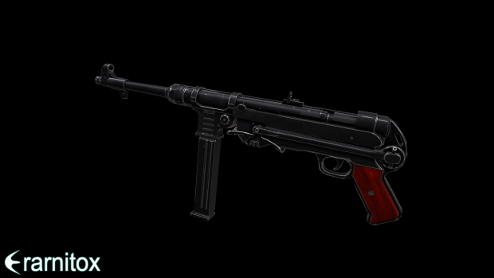
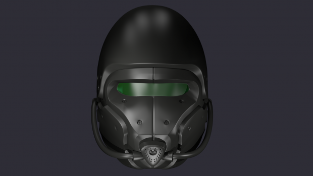
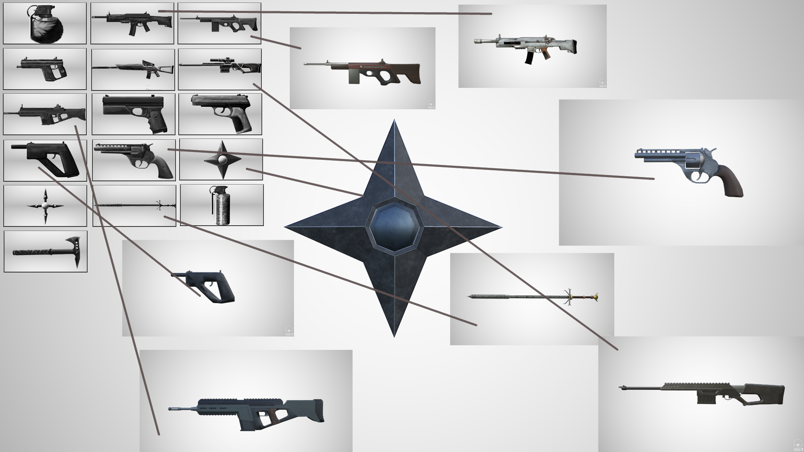

# PlanB - The Making of an Indie FPS

<iframe src="https://www.youtube.com/embed/o7NCBKNbEnA?si=9x-wbOE2lE3EC7Fs" title="YouTube video player" frameborder="0" allow="accelerometer; autoplay; clipboard-write; encrypted-media; gyroscope; picture-in-picture; web-share" referrerpolicy="strict-origin-when-cross-origin" allowfullscreen></iframe>

PlanB is an easy-to-pick-up FPS game, perfect for LAN parties and casual players.

-----

Let's dive into the story of my very first game. Well, "first game" isn't entirely true; I had dabbled with some incredibly simple games before starting PlanB. But, to be honest, my programming experience was pretty limited back then.

## The Spark of Motivation

So, what pushed me into the world of game development? Simply put, I was a huge fan of shooter games. At the time, my two absolute favorites were **Call of Duty: Black Ops** and **Cube 2: Sauerbraten**.

I was always curious about how I could create my own maps and weapons for these games.

## A Trip Down Memory Lane

I knew Sauerbraten was open-source, and after a lot of wrestling with 'Make,' I even managed to compile it myself. However, I quickly realized I was in over my head trying to understand its source code. My programming skills, limited to AutoIt and BASIC, just weren't up to the task. So, I put C++ and my attempts to modify the game on the back burner.

After a while, I stumbled upon some developers on YouTube who were using the **Unity3D** game engine. A few of the early pioneers who inspired me were:

  * **OneManArmy3d:** He was working on an FPS kit and used Call of Duty models for his video previews.
  * **DrunkenLizardGames:** This developer was creating an FPS with a seriously cool animation system and parkour elements.
  * **TheLegoBobafet:** He was working on an untitled FPS at the time, which has since been released as "Red Army."

These creators were the reason I decided to give Unity3D a shot, back when it was in version 3-something. For a good while, all I did was mess around with the bootcamp and the island FPS demo. Eventually, I joined OneManArmy’s forum, armedunity.com, and started using his FPS kit to learn and experiment.

There were also some fantastic YouTubers creating coding tutorials that were perfect for a beginner like me. The most notable were:

  * **NarutoIsGreat12345:** Now known as HyperShadeTutorials. Sadly, the old content is gone.
  * **Eetski Tutorials:** Now known as MasterIndie on YouTube.

But I truly learned the most from the ArmedUnity community (which, by the way, stands for "armed with unity"). The community was filled with amazing people, too many to name them all. However, a special shout-out goes to **OcularCash**, who helped me out directly a few times.

I also have to mention **theMars2011**, who joined the forum a bit later than me but is now working on a really impressive title with a small team.

[Watch his devlog](https://youtu.be/-cW7sM-0jR8)

<iframe src="https://www.youtube.com/embed/-cW7sM-0jR8?si=TUVsuSOYOMQpoKGf" title="YouTube video player" frameborder="0" allow="accelerometer; autoplay; clipboard-write; encrypted-media; gyroscope; picture-in-picture; web-share" referrerpolicy="strict-origin-when-cross-origin" allowfullscreen></iframe>

-----

## The Development of PlanB

After building a solid foundation and understanding the theory behind creating an FPS, I finally felt ready to build my own from scratch. The structure was heavily inspired by OMA’s FPS Kit and guides from the community, but I was determined to create most of it myself.

Without much planning, I dove straight into coding the character controller, weapon scripts, and even started modeling and animating the weapons. I think I managed to get all of this done in a single week before I uploaded this video:

<iframe src="https://www.youtube.com/embed/f8ZaMEcxTbc?si=BS1AUgvyumv55h35" title="YouTube video player" frameborder="0" allow="accelerometer; autoplay; clipboard-write; encrypted-media; gyroscope; picture-in-picture; web-share" referrerpolicy="strict-origin-when-cross-origin" allowfullscreen></iframe>

Initially, I wanted PlanB to be a story-based multiplayer FPS—a SciFi-WW2 shooter, to be exact. I had even modeled some weapons for it.

As you can probably guess, it was a strange idea. Realizing it didn't make much sense, I scrapped the entire story and all the models. Instead, I decided to create a simple multiplayer game set in a completely fictional world.

I ended up ditching all of the previous player and weapon models and decided to design my own using Krita and Gimp. Here are some of the designs I came up with:

After designing, modeling, texturing, and recording sounds for the weapons, I settled on a set of 10. (About 5 weapon designs got scrapped along the way.)

Here’s a video showcasing all the weapons with their sounds in the game:

<iframe src="https://www.youtube.com/embed/nBXmhQrh4hk?si=b4-kq98HhhNUdXSS" title="YouTube video player" frameborder="0" allow="accelerometer; autoplay; clipboard-write; encrypted-media; gyroscope; picture-in-picture; web-share" referrerpolicy="strict-origin-when-cross-origin" allowfullscreen></iframe>

I wanted to focus on the gameplay first, so I implemented a simple zombie AI that would chase and attack the player. I also needed an easy way to save settings, progress, and other data. The existing tools felt lacking, so I created my own simple key-value store solution with some custom editor scripts.

You can check out the tool I developed for saving the game here:

[Download XenoPrefs](https://assetstore.unity.com/packages/tools/input-management/xenoprefs-91971)

Around this time, I also added a class editor to the game, allowing players to create "classes" with their preferred weapons, skins, and perks.

After polishing most of the basic functionality, I made this video:

<iframe src="https://www.youtube.com/embed/QsxkRkalPYs?si=qqPPortV6JDNF1kh" title="YouTube video player" frameborder="0" allow="accelerometer; autoplay; clipboard-write; encrypted-media; gyroscope; picture-in-picture; web-share" referrerpolicy="strict-origin-when-cross-origin" allowfullscreen></iframe>

-----

## Procedural Generation Adventures

I had this idea of creating a vast, Fallout-style wasteland for a map. To save time on level design, I decided to go with procedural generation. This meant:

  * Automatically generating textures and terrain materials.
  * Automatically generating terrain height maps.
  * Automatically applying vegetation and textures to the map.
  * Automatically building a border around the terrain and placing prefabs like buildings.

First, I needed a tool to help me create seamless PBR materials. I ended up writing a simple Java tool that uses some clever tricks to produce some pretty nice results.

<iframe src="https://www.youtube.com/embed/yUWNrMGyGKs?si=kw6CRK0O6hWwtMIa" title="YouTube video player" frameborder="0" allow="accelerometer; autoplay; clipboard-write; encrypted-media; gyroscope; picture-in-picture; web-share" referrerpolicy="strict-origin-when-cross-origin" allowfullscreen></iframe>

I took a trip to the woods with my camera and snapped photos of textures. Then, I wrote a basic terrain generation script that created a height map by layering Perlin noise with different frequencies and amplitudes.

I wanted a bigger terrain than what Unity supports by default, but there was an easy fix: stitching multiple terrains together. By using the size of the terrain and an offset for the Perlin noise function, I could make the terrains stitch together perfectly.

But it still wasn't enough. The tiling on the terrain was too obvious. So, I decided to write a custom terrain shader with harder blending between textures and a few cheap tricks to hide the tiling. This included overlaying a Perlin noise texture to control the hue and blending with a larger version of the same terrain texture based on the camera's distance.

This meant that up close, you'd see the detailed, scaled-down version of the texture. But from a distance, the scaled-up version would become more opaque, hiding the seams and patterns.

The last step was to correct the normals of the vertices at the edges of the stitched terrains. Without neighboring vertices to calculate the correct orientation, these edges were creating a noticeable seam.

After solving this issue, the generated terrain looked like this:

Note that the buildings, trees, and other vegetation were also procedurally placed in logical locations.

This tool is also open-source, and you can get it for **free** here:

[Download XenoSandboxGenerator](https://assetstore.unity.com/packages/tools/terrain/xenosandboxgenerator-132459)

However, after a while, I realized that while I could generate huge maps with this tool, they were ultimately boring to play on.

So, I decided to build a map manually with the help of the Unity Asset Store and a friend. We ended up with this map:

This is the map currently used in the game. The only things left to do were to enable server configuration through a `.conf` file and remove the claymore mines.

These things were buggy, useless, and annoying in multiplayer, so I just got rid of them.

-----

## LAN Gameplay and Final Thoughts

<iframe src="https://www.youtube.com/embed/6T94_kIDLzY?si=HawVkQuHnk48p_VD" title="YouTube video player" frameborder="0" allow="accelerometer; autoplay; clipboard-write; encrypted-media; gyroscope; picture-in-picture; web-share" referrerpolicy="strict-origin-when-cross-origin" allowfullscreen></iframe>

In the end, PlanB turned out to be a really fun game for LAN parties. It's available for Windows, Mac, and Linux here:

<iframe src="https://itch.io/embed/1461146?bg_color=09101b&amp;fg_color=ffffff&amp;link_color=0f587a&amp;border_color=005f9e" frameborder="1rem" class="itch_embed">
    <a href="https://erarnitox.itch.io/planb">PlanB by Erarnitox</a>
</iframe>

I've discontinued the official server, but it's really easy to host your own, as described on the download page. I hope you can try it out and enjoy the game with some friends\!

### What I Learned

Even though this game didn’t turn out to be the next Call of Duty, as my younger self had hoped, it became a fun shooter to play at LAN parties. More importantly, the real value of this project lies in everything I learned along the way.

This includes but is not limited to:
                        
- How to program in general
- Using modeling software like blender
- How game engines work
- introduction to shader programming